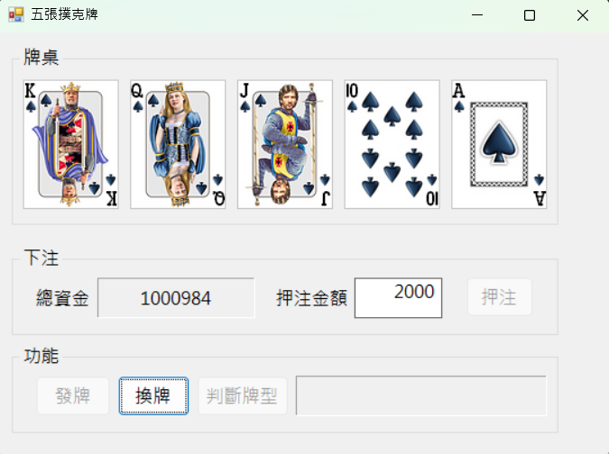

# 五張撲克牌
視窗程式設計 (II) 上課練習

## 功能介紹

* 隨機發五張撲克牌
* 點擊牌面可選擇換牌（翻背面表示要換）
* 點擊換牌後自動補牌
* 判斷牌型（皇家同花順、同花順、四條、葫蘆、同花、順子、三條、兩對、一對、雜牌）
* 下注系統，依牌型賠率計算獲勝金額

## 使用方式

1. 輸入押注金額，點擊「押注」
2. 點擊「發牌」取得五張牌
3. 點擊想換掉的牌（牌會翻回背面）
4. 點擊「換牌」補入新牌
5. 點擊「判斷牌型」查看結果與獲勝金額

## 賠率表

| 牌型 | 賠率 |
|------|------|
| 皇家同花順 | 250 |
| 同花順 | 50 |
| 四條 | 25 |
| 葫蘆 | 9 |
| 同花 | 6 |
| 順子 | 4 |
| 三條 | 3 |
| 兩對 | 2 |
| 一對 | 1 |
| 雜牌 | 損失押注金額 |

## 執行畫面

## 開發環境

* C#
* Windows Forms
* Visual Studio

## 備註

* 初始總資金為 1,000,000 元
* 資金歸零時自動重置
* 已加入押注金額驗證（數字、正值、不可超過總資金）
* 發牌後可使用快捷鍵切換測試牌型（Q / W / E / R / T / Y）